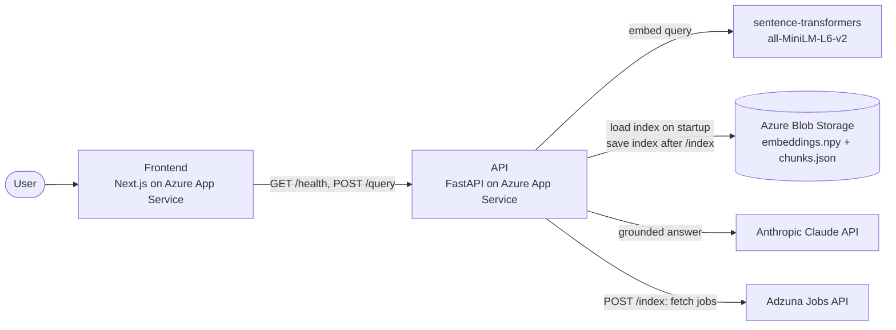
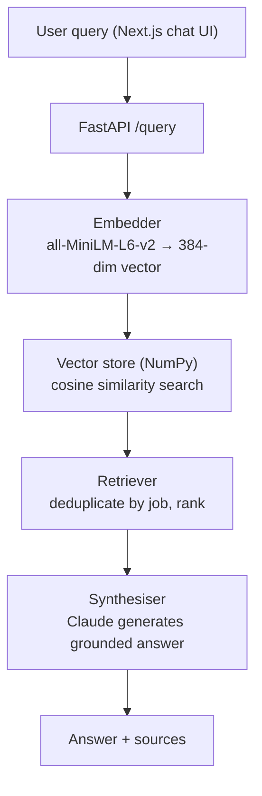
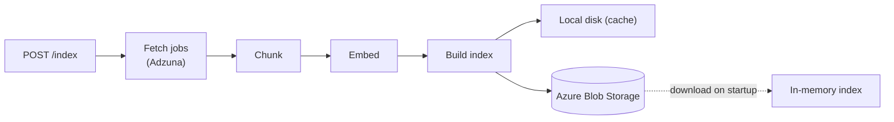
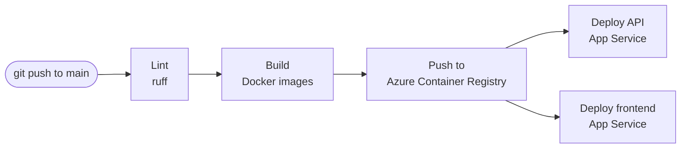

# JobSense 🧠

> Real-time job market intelligence powered by a custom RAG pipeline and Claude AI.

JobSense searches live job listings and uses Claude to generate grounded, honest career insights. Every answer is backed by real job data fetched from the Adzuna API.

---

## Live Demo

- **Frontend** → [jobsense-frontend.azurewebsites.net](https://jobsense-frontend-hkbyeaewepdsc9bs.westus3-01.azurewebsites.net)
- **API** → [jobsense-api.azurewebsites.net/docs](https://jobsense-api-ddhjhreudabcanea.westus3-01.azurewebsites.net/docs)

> **Note:** The app runs on Azure's free App Service tier, which sleeps after about 20 minutes of inactivity. The first load can take up to a minute while the backend wakes up. The UI shows a "Waking up the server…" banner and unlocks the chat automatically once the API is ready.

---

## What it does

Ask JobSense anything about the job market:

- *"What data engineering roles are hiring in London right now?"*
- *"I know Python and Spark — what jobs suit me?"*
- *"What salary should I expect as an MLOps engineer?"*
- *"Which companies are hiring ML engineers right now?"*

It fetches real listings, finds the most relevant ones using semantic search, and hands them to Claude to generate a grounded answer with sources.

---

## Architecture

### Cloud architecture



### RAG pipeline (per query)



### How the index is built and persisted



The App Service disk is wiped on every restart, so Blob Storage is the permanent copy of the index. On startup the API downloads it into memory, and `/query` works immediately with no re-indexing. Without a connection string (for example in local development) it falls back to local disk only.

---

## Stack

| Layer | Technology |
|---|---|
| Frontend | Next.js 16, React 19, Tailwind CSS, TypeScript |
| API | FastAPI |
| LLM | Claude claude-sonnet-4-6 (Anthropic) |
| Embeddings | sentence-transformers / all-MiniLM-L6-v2 |
| Vector store | NumPy (custom, no external DB) |
| Index persistence | Azure Blob Storage |
| Data source | Adzuna Jobs API |
| MLOps | MLflow |
| Containerisation | Docker, Docker Compose |
| CI/CD | GitHub Actions |
| Cloud | Azure App Service, Azure Container Registry, Azure Blob Storage |
| CLI | Python argparse |

Built without LangChain or LlamaIndex — every RAG component written from scratch.

### Azure services

| Service | Purpose |
|---|---|
| App Service (×2) | Hosts the API and frontend containers |
| Container Registry | Stores the Docker images |
| Blob Storage | Persists the vector index across restarts |

---

## Design decisions

- **Blob Storage for the index.** App Service containers have an ephemeral disk, so an index built on the server would vanish on every restart. The index is stored in Blob and downloaded on startup. Both files are downloaded to temporary names and swapped in together, so a failed download can never leave a mismatched pair.
- **Flat NumPy index instead of a vector database.** At this dataset size (hundreds to a few thousand chunks), a single matrix multiply is fast enough and there is no extra service to run or pay for.
- **Cold-start handling in the UI.** On the free tier the backend sleeps when idle. The frontend polls `/health` on load, shows a waking-up banner and only enables the chat once the API is ready.
- **Model baked into the Docker image.** The embedding model is downloaded at build time, so a cold start doesn't need to fetch it from Hugging Face.
- **Blocking endpoints run in a thread pool.** `/query` and `/index` are plain `def` endpoints, so a long Claude call or index build doesn't block `/health`.

---

## Project Structure

```
jobsense/
├── src/
│   ├── ingestion/
│   │   └── job_fetcher.py      # Adzuna API client
│   ├── pipeline/
│   │   ├── chunker.py          # splits job descriptions into chunks
│   │   ├── embedder.py         # sentence-transformers encoder + MLflow
│   │   └── vector_store.py     # numpy index — build / load / search + Azure Blob persistence
│   └── rag/
│       ├── retriever.py        # embed query → search → deduplicate
│       └── synthesiser.py      # context + Claude → grounded answer
├── api/
│   └── main.py                 # FastAPI — /health /index /query
├── frontend/                   # Next.js chatbot UI
│   ├── Dockerfile
│   └── app/
│       ├── page.tsx            # chatbot interface + server wake-up check
│       └── layout.tsx          # app shell
├── .github/
│   └── workflows/
│       └── ci.yml              # GitHub Actions CI/CD pipeline
├── Dockerfile                  # API container
├── docker-compose.yml          # run full stack locally
├── pipeline.py                 # CLI entry point
├── config.yaml                 # chunk size, model, location, top_k, blob settings
└── pyproject.toml
```

---

## Quickstart

### 1. Clone and install

```bash
git clone https://github.com/yourusername/jobsense.git
cd jobsense
python -m venv .venv
source .venv/bin/activate
pip install -e .
pip install -r requirements.txt
```

### 2. Add credentials

Create a `.env` file in the project root:

```
ANTHROPIC_API_KEY=sk-ant-...
ADZUNA_APP_ID=your_app_id
ADZUNA_API_KEY=your_api_key
```

- Anthropic API key → [console.anthropic.com](https://console.anthropic.com)
- Adzuna credentials → [developer.adzuna.com](https://developer.adzuna.com) (free)

Optional: add `AZURE_STORAGE_CONNECTION_STRING=...` to also persist the index to Azure Blob locally. Without it the index is stored on local disk only.

### 3. Build the index

```bash
# Fetch live jobs and build the vector index
python pipeline.py index

# Custom queries
python pipeline.py index \
  --queries "PySpark engineer" "MLOps engineer" "LLM engineer" \
  --max-per-query 20

# Re-index without hitting Adzuna again
python pipeline.py index --no-fetch
```

### 4. Start the API

```bash
uvicorn api.main:app --port 8000
```

### 5. Start the frontend

```bash
cd frontend
npm install
npm run dev
```

Open **http://localhost:3000** — the chatbot is ready.

---

## Run with Docker

```bash
# Run the full stack with one command
docker-compose up --build

# API → http://localhost:8000
# UI  → http://localhost:3000
```

---

## CI/CD Pipeline



Every push to `main` triggers a GitHub Actions pipeline:

```
lint    → ruff checks Python code quality
build   → builds both Docker images
deploy  → pushes to Azure Container Registry
        → deploys to Azure App Service
```

Pull requests run lint and build only; deployment happens on pushes to `main`.

---


## CLI Usage

```bash
python pipeline.py query "Python data engineer with Spark experience"
python pipeline.py query "entry level ML engineer London" --top-k 3
```

---

## API

Interactive docs at **http://localhost:8000/docs**

| Method | Endpoint | Description |
|---|---|---|
| GET | `/health` | Liveness check, index status and index source (`blob` / `disk` / `built`) |
| POST | `/index` | Fetch jobs, rebuild the vector index and save it to Blob |
| POST | `/query` | RAG query — returns answer + sources |
| GET | `/index/stats` | Detailed index statistics |

### Example

```bash
curl -X POST http://localhost:8000/query \
     -H "Content-Type: application/json" \
     -d '{"query": "Python data engineer with Spark experience"}'
```

### Response

```json
{
  "answer": "Based on the current listings, two roles stand out...",
  "query": "Python data engineer with Spark experience",
  "model": "claude-sonnet-4-6",
  "input_tokens": 1198,
  "output_tokens": 312,
  "latency_secs": 8.95,
  "sources": [
    {
      "rank": 1,
      "title": "Data Engineer",
      "company": "Monzo",
      "location": "London, UK",
      "salary": "£70,000 – £90,000",
      "score": 0.8821,
      "url": "https://..."
    }
  ]
}
```

---

## MLflow Tracking

Every pipeline run is tracked automatically:

```bash
mlflow ui
# Open http://localhost:5000
```

Tracked experiments:
- `jobsense-embeddings` — encode time, chunks/sec, model name
- `jobsense-index` — index size, build time
- `jobsense-synthesis` — token usage, latency, chunks used

---

## Configuration

Edit `config.yaml` to tune the pipeline:

```yaml
ingestion:
  max_jobs: 500
  location: "London, UK"

pipeline:
  chunk_size: 256          # tokens per chunk
  chunk_overlap: 40        # token overlap between chunks
  embedding_model: "all-MiniLM-L6-v2"
  top_k: 5                 # chunks to retrieve per query

blob:
  container: "jobsense-index"   # Azure Blob container (created on first upload)
  prefix: "current/"            # blob name prefix for the index files
```